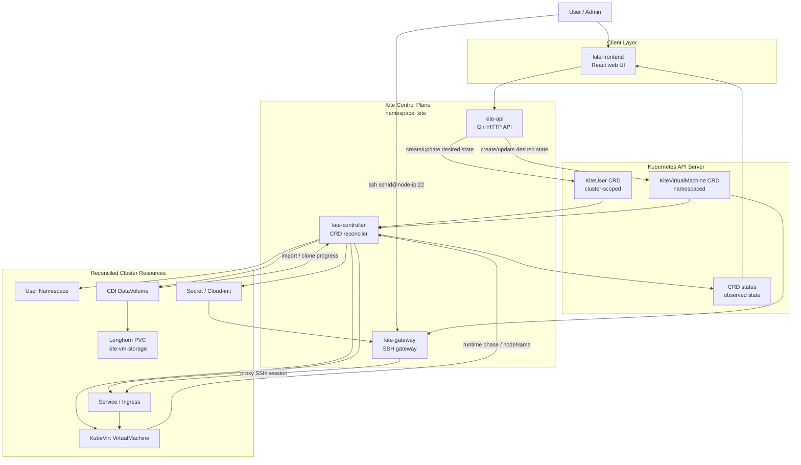

# Kite
<div align="center">
  
</div>

Kite는 Kubernetes 클러스터 위에서 사용자별 KubeVirt 가상 머신을 생성하고 운영하기 위한 컨트롤 플레인입니다.

사용자는 웹 UI 또는 HTTP API로 계정과 VM을 요청합니다. `kite-api`는 요청을 검증하고 Kite CRD를 Kubernetes API server에 기록합니다. `kite-controller`는 CRD를 watch하면서 Namespace, KubeVirt VirtualMachine, CDI DataVolume, Service, Ingress, Secret 같은 실제 클러스터 리소스를 원하는 상태로 맞춥니다. VM 디스크는 Longhorn StorageClass와 CDI DataVolume을 사용합니다.

## Architecture



Kite는 명령형 RPC로 controller를 호출하지 않습니다. API 서버는 CRD의 desired state를 쓰고, controller는 Kubernetes controller 방식으로 reconcile합니다.

## Design Decisions

### CRD 중심 reconcile

Kite는 API 서버가 controller에 직접 명령을 보내는 구조를 쓰지 않습니다.
`kite-api`는 사용자 요청을 검증한 뒤 `KiteUser`와 `KiteVirtualMachine` CRD의
`spec`만 갱신합니다. `kite-controller`는 이 desired state를 watch하고 실제
Namespace, KubeVirt VM, DataVolume, Service, Secret, Ingress 상태를 맞춥니다.

이 방식을 선택한 이유는 다음과 같습니다.

- Kubernetes API server와 etcd를 단일 상태 저장소로 사용해 API와 controller를 느슨하게 분리합니다.
- API process가 재시작되어도 이미 기록된 CRD spec을 기준으로 controller가 계속 수렴할 수 있습니다.
- 실제 KubeVirt/CDI 리소스 상태 변화는 controller가 `status`에 다시 기록하므로 프론트엔드는 CRD 상태만 보면 됩니다.
- gRPC 같은 별도 API 계약을 유지하지 않아도 Kubernetes validation, RBAC, watch cache를 그대로 활용할 수 있습니다.

### SSH gateway

Kite는 VM별 NodePort를 만들지 않습니다. VM마다 외부 포트를 하나씩 소모하면
포트 관리가 어려워지고, VM 삭제 실패 시 고아 포트가 남을 수 있기 때문입니다.
대신 `kite-gateway`가 외부 SSH 22번을 받고, SSH login username을
`KiteVirtualMachine.spec.sshId`와 매칭해 내부 `vps-access-<vmName>` ClusterIP
Service로 프록시합니다.

```text
ssh <sshId>@<node-ip>:22
  -> kite-gateway
  -> KiteVirtualMachine(spec.sshId) lookup
  -> vps-access-<vmName>.<namespace>.svc.cluster.local:22
  -> VM sshd
```

외부 사용자의 password는 `spec.sshPasswordHash`로 검증하고, VM 내부 접속은
controller가 만든 SSH key Secret을 사용합니다. VM cloud-init에는 이 public key만
들어가며 VM 내부 password login은 꺼져 있습니다.

기존 host sshd도 고려합니다. 설치 시 host sshd가 22번을 쓰고 있으면 이동할
포트를 물어보고, 같은 포트를 한 번 더 입력해야 설정을 바꿉니다. 선택한 포트가
이미 사용 중이면 아무 설정도 바꾸지 않고 다시 묻거나 실패합니다. `kite-gateway`는
VM route가 없는 username에 한해 host sshd `<node-ip>:선택포트`로 fallback합니다.
그래서 기존 host 계정도 계속 아래 방식으로 접속할 수 있습니다.

```sh
ssh <host-user>@<node-ip>
```

단, host Linux username과 VM `sshId`가 같으면 VM route가 우선입니다. 이때 host
관리는 설치 때 선택한 host sshd 포트를 명시합니다.

```sh
ssh <host-user>@<node-ip> -p <selected-host-sshd-port>
```

## Components

### `kite/cmd`

- `kite/cmd/kite-api`: Gin 기반 HTTP API 서버입니다. 로그인, 회원가입, 사용자 관리, VM 관리, 전역 설정 API를 제공하고 `KiteUser`, `KiteVirtualMachine` CRD를 Kubernetes API server에 기록합니다.
- `kite/cmd/kite-controller`: Kite CRD와 KubeVirt/CDI 리소스를 watch하는 controller입니다. CRD spec을 원하는 상태로 보고 실제 Kubernetes 리소스를 생성, 갱신, 삭제한 뒤 CRD status에 관측 상태를 씁니다.
- `kite/cmd/kite-gateway`: Kubernetes 내부에서 실행되는 SSH gateway입니다. 외부 SSH 연결을 받아 Kite VM 상태와 Secret을 기준으로 인증하고, 사용자 VM의 `vps-access-<vmName>` Service로 SSH session을 프록시합니다.

### `kite/api`

- `kite/api/v1`: Kite CRD spec/status를 Go 코드에서 다루기 위한 타입입니다.
- `kite/api/proto`: 이전 gRPC 설계 초안입니다. 현재 설계에서는 사용하지 않으며, API 서버와 controller 사이의 기본 흐름은 CRD 기반 reconcile입니다.

### `kite/internal`

- `kite/internal/kube`: in-cluster config와 local kubeconfig fallback을 포함한 Kubernetes client 생성 코드입니다.
- `kite/internal/store`: API 서버가 `KiteUser`, `KiteVirtualMachine` CRD를 읽고 쓰기 위한 dynamic client 기반 store입니다.
- `kite/internal/render`: controller가 Namespace, DataVolume, KubeVirt VM, Service, Ingress, Secret, NetworkPolicy, QuotaPolicy 등을 만들 때 사용하는 YAML renderer입니다.
- `kite/internal/account`, `kite/internal/auth`, `kite/internal/vm`: API 요청을 CRD spec으로 변환하고 인증, 권한, VM 요청 처리를 담당하는 service layer입니다.
- `kite/internal/platform`: base domain, TLS Secret, runtime config 같은 platform 설정을 관리합니다.
- `kite/internal/gateway`: `kite-gateway`의 route table, SSH server, Kubernetes Secret/Service 조회, VM SSH 프록시 로직입니다.

### Frontend

- `kite-frontend`: Vite/React 기반 웹 UI입니다. 사용자 로그인, VM 목록/상세, 관리자 대시보드, 전역 설정 화면을 제공합니다.

## Custom Resources

Kite가 관리하는 Kubernetes API는 `build/kite/crds.yaml`에 정의되어 있습니다.

| Kind | Scope | Resource | Purpose |
| --- | --- | --- | --- |
| `KiteUser` | Cluster | `kiteusers.hy3ons.github.io` | Kite 사용자, 권한, 사용자 namespace desired state |
| `KiteVirtualMachine` | Namespaced | `kitevirtualmachines.hy3ons.github.io` | 사용자별 VM spec, 전원 의도, 디스크/접속 정보, VM status |

`KiteUser`는 cluster-scoped 리소스이므로 namespace 없이 생성됩니다. `KiteVirtualMachine`은 사용자 namespace에 생성되고, controller가 같은 namespace에 VM 관련 리소스를 만듭니다.

## Repository Layout

```text
.
├── build/
│   ├── kite/              # Kite application 공통 Kubernetes manifests
│   ├── kite-storage/      # Longhorn StorageClass, cleanup, golden image manifests
│   ├── dev/               # local Docker build + current cluster deploy scripts
│   ├── deploy/            # k3s production-oriented install scripts
│   └── examples/          # KiteUser, KiteVirtualMachine example resources
├── docs/                  # project conventions
├── kite/
│   ├── cmd/               # kite-api, kite-controller, kite-gateway entrypoints
│   ├── api/               # CRD Go types and retired proto draft
│   └── internal/          # Kubernetes clients, stores, renderers, services
├── kite-frontend/         # web frontend
├── test                   # smoke test wrapper
└── test.sh                # cluster smoke test script
```

## Kubernetes Manifests

- `build/kite`: Kite runtime manifests shared by development and production installs. It includes namespace, CRDs, ServiceAccount, RBAC, API deployment, controller deployment, gateway deployment, frontend deployment, and Services.
- `build/kite-storage/longhorn/storageclass.yaml`: Kite VM disks use `kite-vm-storage`, backed by Longhorn with `diskSelector: "kite"`.
- `build/kite-storage/golden-images/ubuntu-22.04.yaml`: Ubuntu golden image DataVolume imported by CDI.
- `build/kite-storage/longhorn-cleanup`: optional cleanup DaemonSet for Kite-owned Longhorn host data.
- `build/examples`: example custom resources for manual CRD testing.

## Install Modes

Kite has two top-level install entrypoints:

- `./install.sh`: pull-based install. It installs or waits for Longhorn,
  KubeVirt, CDI, applies the Ubuntu golden image, and deploys Kite manifests
  that pull prebuilt images from `ghcr.io/hy3ons`.
- `./dev.sh`: local-build install. It prepares the same infrastructure, builds
  the API, controller, gateway, and frontend images from this checkout, then
  imports or loads those images into the selected local cluster before deploying
  Kite.

Both install modes deploy `kite-gateway` as the SSH entrypoint. When the target
host is Linux with systemd OpenSSH and the gateway external port is `22`, the
install flow first checks whether host `sshd` already avoids port `22`. If it
does, Kite does not move it and patches gateway fallback to that existing port.
If host `sshd` still needs to move, the flow asks which port should receive it,
checks that the port is free, and requires typing the same port again before
changing the host. The original config is backed up under `/etc/kite/host-sshd`,
and `./clear.sh`, `./clean.sh`, or `build/deploy/scripts/uninstall-kite.sh` can
restore it from that backup. Hosts without OpenSSH, systemd, Linux, or an active
port `22` listener are skipped safely.

## Quick Install and Uninstall

Install Kite on a prepared k3s or Kubernetes host without cloning this
repository:

```sh
curl -fsSL https://raw.githubusercontent.com/Hy3ons/KiteVirtualMachines/main/install.sh | bash
```

Install from a specific branch or tag:

```sh
curl -fsSL https://raw.githubusercontent.com/Hy3ons/KiteVirtualMachines/main/install.sh \
  | KITE_INSTALL_REF=stage bash
```

The remote installer downloads the selected GitHub archive into a temporary
directory and runs `build/deploy/scripts/install-all.sh`. It uses GHCR images
and does not build containers locally.

Uninstall Kite resources without cloning this repository:

```sh
curl -fsSL https://raw.githubusercontent.com/Hy3ons/KiteVirtualMachines/main/clean.sh | bash
```

Uninstall from a specific branch or tag:

```sh
curl -fsSL https://raw.githubusercontent.com/Hy3ons/KiteVirtualMachines/main/clean.sh \
  | KITE_CLEAN_REF=stage bash
```

The remote cleanup flow downloads the selected GitHub archive into a temporary
directory and runs `build/deploy/scripts/clean.sh`, which delegates to
`build/deploy/scripts/uninstall-kite.sh`. By default it removes Kite CRDs,
namespace resources, Deployments, Services, and Kite-owned runtime state.
Longhorn storage cleanup stays opt-in because it can delete VM disk
infrastructure.

## Development Install

`./dev.sh` builds local Docker images and deploys them to the selected Kubernetes cluster.

```sh
KITE_CLUSTER=k3s ./dev.sh
```

Supported `KITE_CLUSTER` values are `minikube`, `k3s`, `k3d`, `kind`, `k8s`, `kubernetes`, and `current`.

For local clusters, the script builds these images and loads or imports them into the cluster runtime when needed:

- `ghcr.io/hy3ons/kite-api:<tag>`
- `ghcr.io/hy3ons/kite-controller:<tag>`
- `ghcr.io/hy3ons/kite-gateway:<tag>`
- `ghcr.io/hy3ons/kite-frontend:<tag>`

Generic Kubernetes clusters usually need a registry push:

```sh
PUSH_IMAGES=true IMAGE_REGISTRY=registry.example.com/kite KITE_CLUSTER=k8s ./dev.sh
```

Development cleanup:

```sh
KITE_CLUSTER=k3s ./clear.sh
```

Longhorn cleanup is opt-in because it can remove VM disk infrastructure:

```sh
CLEAR_LONGHORN=true KITE_CLUSTER=k3s ./clear.sh
CLEAR_LONGHORN_DATA=true CLEAR_LONGHORN_DATA_CONFIRM=true KITE_CLUSTER=k3s ./clear.sh
```

More details are in `build/dev/README.md`. The full `build` directory layout
and `clear`/`clean` naming contract are documented in `build/README.md`.

Host SSHD handoff can be controlled with environment variables:

```sh
KITE_MANAGE_HOST_SSHD=true KITE_CLUSTER=k3s ./dev.sh
MANAGE_HOST_SSHD=false KITE_CLUSTER=k3s ./dev.sh
KITE_RESTORE_HOST_SSHD=true KITE_CLUSTER=k3s ./clear.sh
RESTORE_HOST_SSHD=false KITE_CLUSTER=k3s ./clear.sh
```

## Production-Oriented k3s Install

`./install.sh` contains a pull-based install flow for k3s clusters. Longhorn,
KubeVirt, and CDI are required for VM disk provisioning and VM runtime. Kite
images are pulled from GHCR instead of being built locally.

The download install flow is intentionally split into two steps:

1. `install.sh` is the small bootstrap script fetched by `curl`.
2. The bootstrap script downloads the selected repository ref as a tar archive,
   extracts it under a temporary directory, and executes
   `build/deploy/scripts/install-all.sh` from that extracted copy.

That inner installer installs or waits for Longhorn, KubeVirt, and CDI, prepares
the Ubuntu golden image DataVolume, creates the Kite gateway host key Secret,
and deploys the Kite manifests using GHCR images.

```sh
kubectl get nodes
INSTALL_LONGHORN=true ./install.sh
build/deploy/scripts/verify.sh
```

If Longhorn is already installed and ready:

```sh
./install.sh
```

Expected storage flow:

```text
kite/ubuntu-22.04 DataVolume
  -> PVC using StorageClass kite-vm-storage

user namespace VM DataVolume
  -> clone source pvc kite/ubuntu-22.04
  -> PVC using StorageClass kite-vm-storage
```

Uninstall Kite resources:

```sh
build/deploy/scripts/uninstall-kite.sh
```

The remote cleanup commands are listed in
[Quick Install and Uninstall](#quick-install-and-uninstall). The cleanup removes
Kite application resources and Kite CRDs first, then optionally restores the
host SSHD handoff and removes Kite Longhorn disk data only when the explicit
cleanup environment variables are set.

More details are in `build/deploy/README.md`.

The same host SSHD handoff variables are supported by `./install.sh`,
`./clean.sh`, and `build/deploy/scripts/uninstall-kite.sh`.

## Container Images

Production images are published to GHCR when commits land on `main`.

| Component | Image |
| --- | --- |
| `kite-api` | `ghcr.io/hy3ons/kite-api` |
| `kite-controller` | `ghcr.io/hy3ons/kite-controller` |
| `kite-gateway` | `ghcr.io/hy3ons/kite-gateway` |
| `kite-frontend` | `ghcr.io/hy3ons/kite-frontend` |

The workflow publishes these tags:

- `latest`
- `main`
- `production`
- `sha-<commit>`

The workflow logs in with the `GHCR_TOKEN` GitHub secret. `./install.sh` uses
the GHCR images by default, while `./dev.sh` builds images locally and imports
or loads them into the selected development cluster.

## Smoke Test

After deployment, run:

```sh
./test
```

The smoke test checks the Kite namespace, CRDs, deployments, API health, signup/login flow, and basic `KiteUser` visibility.

## Runtime Notes

- Kite runtime resources run in the `kite` namespace.
- CRDs are cluster-wide API extensions and do not have a namespace.
- `KiteUser` instances are cluster-scoped.
- `KiteVirtualMachine` instances are namespaced.
- In-cluster execution uses the mounted service account. Local kubeconfig fallback is for development.
- VM disks use CDI DataVolume and Longhorn.
- The controller writes observed state to CRD `status`; user intent belongs in CRD `spec`.

## Related Docs

- `kite/cmd/kite-api/Readme.md`
- `kite/cmd/kite-controller/Readme.md`
- `kite/cmd/kite-gateway/Readme.md`
- `build/dev/README.md`
- `build/deploy/README.md`
- `build/kite/README.md`
- `build/kite-storage/README.md`
- `build/examples/README.md`
