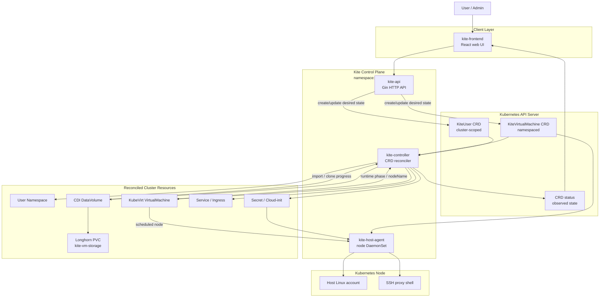

# Kite


Kite는 Kubernetes 클러스터 위에서 사용자별 KubeVirt 가상 머신을 생성하고 운영하기 위한 컨트롤 플레인입니다.

사용자는 웹 UI 또는 HTTP API로 계정과 VM을 요청합니다. `kite-api`는 요청을 검증하고 Kite CRD를 Kubernetes API server에 기록합니다. `kite-controller`는 CRD를 watch하면서 Namespace, KubeVirt VirtualMachine, CDI DataVolume, Service, Ingress, Secret 같은 실제 클러스터 리소스를 원하는 상태로 맞춥니다. VM 디스크는 Longhorn StorageClass와 CDI DataVolume을 사용합니다.

## Architecture



Kite는 명령형 RPC로 controller를 호출하지 않습니다. API 서버는 CRD의 desired state를 쓰고, controller는 Kubernetes controller 방식으로 reconcile합니다.

## Components

### `kite/cmd`

- `kite/cmd/kite-api`: Gin 기반 HTTP API 서버입니다. 로그인, 회원가입, 사용자 관리, VM 관리, 전역 설정 API를 제공하고 `KiteUser`, `KiteVirtualMachine` CRD를 Kubernetes API server에 기록합니다.
- `kite/cmd/kite-controller`: Kite CRD와 KubeVirt/CDI 리소스를 watch하는 controller입니다. CRD spec을 원하는 상태로 보고 실제 Kubernetes 리소스를 생성, 갱신, 삭제한 뒤 CRD status에 관측 상태를 씁니다.
- `kite/cmd/kite-host-agent`: 각 Kubernetes node에서 DaemonSet으로 실행되는 host agent입니다. VM이 배치된 node의 Linux 계정, SSH private key, proxy shell을 맞춰 host SSH 접속을 VM SSH 접속으로 연결합니다.

### `kite/api`

- `kite/api/v1`: Kite CRD spec/status를 Go 코드에서 다루기 위한 타입입니다.
- `kite/api/proto`: 이전 gRPC 설계 초안입니다. 현재 설계에서는 사용하지 않으며, API 서버와 controller 사이의 기본 흐름은 CRD 기반 reconcile입니다.

### `kite/internal`

- `kite/internal/kube`: in-cluster config와 local kubeconfig fallback을 포함한 Kubernetes client 생성 코드입니다.
- `kite/internal/store`: API 서버가 `KiteUser`, `KiteVirtualMachine` CRD를 읽고 쓰기 위한 dynamic client 기반 store입니다.
- `kite/internal/render`: controller가 Namespace, DataVolume, KubeVirt VM, Service, Ingress, Secret, NetworkPolicy, QuotaPolicy 등을 만들 때 사용하는 YAML renderer입니다.
- `kite/internal/account`, `kite/internal/auth`, `kite/internal/vm`: API 요청을 CRD spec으로 변환하고 인증, 권한, VM 요청 처리를 담당하는 service layer입니다.
- `kite/internal/platform`: base domain, TLS Secret, runtime config 같은 platform 설정을 관리합니다.
- `kite/internal/hostaccount`: host-agent가 node의 Linux 계정과 SSH proxy shell을 맞출 때 사용하는 host OS 작업 코드입니다.

### Frontend

- `kite-frontend`: Vite/React 기반 웹 UI입니다. 사용자 로그인, VM 목록/상세, 관리자 대시보드, 전역 설정 화면을 제공합니다.

## Custom Resources

Kite가 관리하는 Kubernetes API는 `build/kite/crds.yaml`에 정의되어 있습니다.

| Kind | Scope | Resource | Purpose |
| --- | --- | --- | --- |
| `KiteUser` | Cluster | `kiteusers.hy3ons.github.io` | Kite 사용자, 권한, 사용자 namespace desired state |
| `KiteVirtualMachine` | Namespaced | `kitevirtualmachines.hy3ons.github.io` | 사용자별 VM spec, 전원 의도, 디스크/접속 정보, VM status |

`KiteUser`는 cluster-scoped 리소스이므로 namespace 없이 생성됩니다. `KiteVirtualMachine`은 사용자 namespace에 생성되고, controller가 같은 namespace에 VM 관련 리소스를 만듭니다.

## Repository Layout

```text
.
├── build/
│   ├── kite/              # Kite application 공통 Kubernetes manifests
│   ├── kite-storage/      # Longhorn StorageClass, cleanup, golden image manifests
│   ├── dev/               # local Docker build + current cluster deploy scripts
│   ├── deploy/            # k3s production-oriented install scripts
│   └── examples/          # KiteUser, KiteVirtualMachine example resources
├── docs/                  # project conventions
├── kite/
│   ├── cmd/               # kite-api, kite-controller, kite-host-agent entrypoints
│   ├── api/               # CRD Go types and retired proto draft
│   └── internal/          # Kubernetes clients, stores, renderers, services
├── kite-frontend/         # web frontend
├── test                   # smoke test wrapper
└── test.sh                # cluster smoke test script
```

## Kubernetes Manifests

- `build/kite`: Kite runtime manifests shared by development and production installs. It includes namespace, CRDs, ServiceAccount, RBAC, API deployment, controller deployment, frontend deployment, and host-agent DaemonSet.
- `build/kite-storage/longhorn/storageclass.yaml`: Kite VM disks use `kite-vm-storage`, backed by Longhorn with `diskSelector: "kite"`.
- `build/kite-storage/golden-images/ubuntu-22.04.yaml`: Ubuntu golden image DataVolume imported by CDI.
- `build/kite-storage/longhorn-cleanup`: optional cleanup DaemonSet for Kite-owned Longhorn host data.
- `build/examples`: example custom resources for manual CRD testing.

## Development Install

`build/dev/dev.sh` builds local Docker images and deploys them to the selected Kubernetes cluster.

```sh
KITE_CLUSTER=k3s build/dev/dev.sh
```

Supported `KITE_CLUSTER` values are `minikube`, `k3s`, `k3d`, `kind`, `k8s`, `kubernetes`, and `current`.

For local clusters, the script builds these images and loads or imports them into the cluster runtime when needed:

- `ghcr.io/hy3ons/kite-api:<tag>`
- `ghcr.io/hy3ons/kite-controller:<tag>`
- `ghcr.io/hy3ons/kite-host-agent:<tag>`
- `ghcr.io/hy3ons/kite-frontend:<tag>`

Generic Kubernetes clusters usually need a registry push:

```sh
PUSH_IMAGES=true IMAGE_REGISTRY=registry.example.com/kite KITE_CLUSTER=k8s build/dev/dev.sh
```

Development cleanup:

```sh
KITE_CLUSTER=k3s build/dev/clear.sh
```

Longhorn cleanup is opt-in because it can remove VM disk infrastructure:

```sh
CLEAR_LONGHORN=true KITE_CLUSTER=k3s build/dev/clear.sh
CLEAR_LONGHORN_DATA=true CLEAR_LONGHORN_DATA_CONFIRM=true KITE_CLUSTER=k3s build/dev/clear.sh
```

More details are in `build/dev/README.md`.

## Production-Oriented k3s Install

`build/deploy` contains an install flow for k3s clusters. Longhorn, KubeVirt, and CDI are required for VM disk provisioning and VM runtime.

```sh
kubectl get nodes
INSTALL_LONGHORN=true build/deploy/scripts/install-all.sh
build/deploy/scripts/verify.sh
```

If Longhorn is already installed and ready:

```sh
build/deploy/scripts/install-all.sh
```

Expected storage flow:

```text
kite/ubuntu-22.04 DataVolume
  -> PVC using StorageClass kite-vm-storage

user namespace VM DataVolume
  -> clone source pvc kite/ubuntu-22.04
  -> PVC using StorageClass kite-vm-storage
```

Uninstall Kite resources:

```sh
build/deploy/scripts/uninstall-kite.sh
```

More details are in `build/deploy/README.md`.

## Smoke Test

After deployment, run:

```sh
./test
```

The smoke test checks the Kite namespace, CRDs, deployments, API health, signup/login flow, and basic `KiteUser` visibility.

## Runtime Notes

- Kite runtime resources run in the `kite` namespace.
- CRDs are cluster-wide API extensions and do not have a namespace.
- `KiteUser` instances are cluster-scoped.
- `KiteVirtualMachine` instances are namespaced.
- In-cluster execution uses the mounted service account. Local kubeconfig fallback is for development.
- VM disks use CDI DataVolume and Longhorn.
- The controller writes observed state to CRD `status`; user intent belongs in CRD `spec`.

## Related Docs

- `kite/cmd/kite-api/Readme.md`
- `kite/cmd/kite-controller/Readme.md`
- `kite/cmd/kite-host-agent/Readme.md`
- `build/dev/README.md`
- `build/deploy/README.md`
- `build/kite/README.md`
- `build/kite-storage/README.md`
- `build/examples/README.md`
