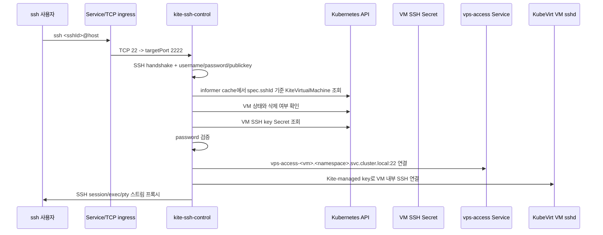

# Kite TODO

## 현재 결정

SSH 진입 라우팅은 장기적으로 `kite-host-agent`의 호스트 Linux 계정 생성 방식에서 벗어나, Kubernetes 내부에서 동작하는 `kite-ssh-control` 방식으로 전환한다.

현재 `kite-host-agent` 방식은 다음 일을 한다.

- 노드의 호스트 OS에 Linux 계정을 만든다.
- `/home/<sshId>/custom-shell.sh`를 만든다.
- 호스트 계정의 `~/.ssh/id_rsa`에 VM 접속용 private key를 저장한다.
- 호스트 OS에서 `*.svc.cluster.local`을 해석할 수 있도록 DNS 설정을 건드린다.
- 사용자가 `ssh <sshId>@host`로 접속하면 custom shell이 VM Service로 다시 SSH를 연결한다.

이 방식은 테스트에는 쓸 수 있지만, 호스트 OS 자체를 Kite 제어면에 포함시킨다. 그래서 설치가 복잡해지고, cleanup도 완벽하게 보장하기 어렵다.

최종 목표 구조는 다음과 같다.

```text
사용자 SSH client
  -> 노드 public IP:22
  -> Kubernetes Service / TCP ingress
  -> Kubernetes 안의 kite-ssh-control
  -> Kite CRD/Secret 상태를 보고 인증과 라우팅 결정
  -> vps-access-<vmName>.<namespace>.svc.cluster.local:22 로 SSH 프록시
  -> VM 내부 sshd
```

이 구조에서는 인증, 라우팅, DNS, VM 조회가 모두 Kubernetes 내부에서 처리된다.
호스트 OS에는 사용자 Linux 계정, `/home/<sshId>`, custom shell, resolver 설정을 만들지 않는다.

## 목표 아키텍처: kite-ssh-control

### 컴포넌트 이름

새 컴포넌트 이름은 `kite-ssh-control`로 한다.

예상 경로:

- `kite/cmd/kite-ssh-control`
- `kite/internal/sshcontrol`
- `kite/Dockerfile.ssh-control`
- `build/kite/ssh-control.yaml`

`kite-host-agent`는 `kite-ssh-control`이 안정화될 때까지 임시 호환 경로로만 유지한다.
SSH 진입 기능이 `kite-ssh-control`로 넘어가면 host account reconcile은 제거 대상이다.

## 배포 방식

기본 목표는 `kite-ssh-control`을 일반 Deployment로 실행하는 것이다.
가능하면 control plane 또는 Kite 관리 노드에만 배치한다.

```yaml
apiVersion: apps/v1
kind: Deployment
metadata:
  name: kite-ssh-control
  namespace: kite
spec:
  replicas: 1
  template:
    spec:
      serviceAccountName: kite-control-plane
      nodeSelector:
        node-role.kubernetes.io/control-plane: "true"
      containers:
        - name: kite-ssh-control
          image: ghcr.io/hy3ons/kite-ssh-control:latest
          ports:
            - name: ssh
              containerPort: 2222
              protocol: TCP
```

앞단에는 Service를 둔다.

개발 기본값은 NodePort 30222를 사용한다.

```yaml
apiVersion: v1
kind: Service
metadata:
  name: kite-ssh-control
  namespace: kite
spec:
  type: NodePort
  selector:
    app: kite-ssh-control
  ports:
    - name: ssh
      port: 22
      targetPort: 2222
      nodePort: 30222
```

운영에서 22번을 직접 쓰고 싶으면 두 가지 선택지가 있다.

### 선택지 A: K3s ServiceLB / LoadBalancer

K3s의 ServiceLB 또는 MetalLB를 사용해 `type: LoadBalancer` Service를 만든다.
가능하면 이 방식을 우선 검토한다.

이유:

- `kite-ssh-control` pod가 호스트 네트워크와 계정에 접근하지 않는다.
- Kubernetes Service가 진입점을 고정한다.
- pod 재시작과 rolling update가 쉬워진다.
- `*.svc.cluster.local` DNS를 기본 kube-dns로 바로 사용할 수 있다.

예상 Service:

```yaml
apiVersion: v1
kind: Service
metadata:
  name: kite-ssh-control
  namespace: kite
spec:
  type: LoadBalancer
  selector:
    app: kite-ssh-control
  ports:
    - name: ssh
      port: 22
      targetPort: 2222
```

### 선택지 B: NodePort 22

Kubernetes 기본 NodePort 범위는 보통 `30000-32767`이다.
NodePort로 22번을 직접 쓰려면 K3s API server 옵션을 바꿔야 한다.

```text
--service-node-port-range=1-65535
```

이 방식은 가능하지만 기본값으로 두지 않는다.
클러스터 설정 변경이 필요하고, 호스트 SSHD의 22번 포트와 충돌할 수 있다.

### 선택지 C: hostPort fallback

Service 기반 진입이 막히면 마지막 fallback으로 `hostPort`를 검토한다.

```yaml
ports:
  - name: ssh
    containerPort: 2222
    hostPort: 22
    protocol: TCP
```

`hostNetwork: true`와 `privileged: true`는 기본 설계에서 제외한다.

## 호스트 SSHD 처리

노드의 기존 `sshd`도 보통 `0.0.0.0:22`를 사용한다.
ServiceLB/LoadBalancer 또는 NodePort 30222를 쓰면 host sshd를 건드리지 않는다.

설치 스크립트가 자동으로 `/etc/ssh/sshd_config`를 수정하면 위험하다. 관리 SSH가 끊길 수 있기 때문이다.

따라서 기본 방침:

- install/dev 스크립트는 기본적으로 host sshd 설정을 변경하지 않는다.
- 개발은 `ssh -p 30222 <sshId>@host`를 기본으로 한다.
- 운영에서 22번을 쓰려면 LoadBalancer/ServiceLB/TCP ingress를 먼저 검토한다.
- hostPort 22를 쓰는 경우에만 22번 포트 점유 여부를 감지한다.
- 자동으로 host sshd 설정을 바꾸지 않는다.
- 운영자가 직접 host sshd를 2222 같은 포트로 옮긴 뒤에만 hostPort 22를 활성화한다.

예상 수동 작업:

```sh
sudo sed -i 's/^#\?Port .*/Port 2222/' /etc/ssh/sshd_config
sudo systemctl restart ssh
```

초기 개발 단계에서는 `kite-ssh-control`을 바로 22번에 붙이지 말고 NodePort 30222로 테스트한다.

```sh
ssh -p 30222 asdf@hy3on.site
```

## 인증 계획

### 1차 구현: Kite 상태 기반 password 인증

stock `sshd`를 컨테이너에서 실행하기보다 Go SSH server를 직접 구현하는 방향이 좋다.

사용 후보:

- `golang.org/x/crypto/ssh`

기본 흐름:



프로토타입에서는 `spec.sshPassword`를 기준으로 인증할 수 있다. 하지만 운영 전에는 plaintext password를 CRD spec에 두면 안 된다.
`kite-ssh-control`은 etcd를 직접 읽지 않는다. Kubernetes API와 informer cache를 통해 CRD/Secret/Service 상태를 읽는다.

운영 전 개선 방향:

- VM 접속 비밀번호는 Secret으로 이동한다.
- password는 단방향 hash로 저장한다.
- `kite-ssh-control`은 hash 검증만 수행한다.
- CRD status에는 password나 private key를 절대 넣지 않는다.

### 2차 구현: Public key 인증

password 인증이 안정화되면 public key 인증도 지원한다.

목표 상태:

- `KiteVirtualMachine.spec.sshId`
- `KiteVirtualMachine.status.sshKeySecretName`
- Secret data:
  - `id_rsa`: `kite-ssh-control`이 VM 내부로 접속할 때 사용하는 private key
  - `id_rsa.pub`: VM cloud-init에 주입한 public key
  - `authorized_keys`: 외부 사용자가 `kite-ssh-control`에 접속할 때 허용할 public key 목록

외부 사용자는 `kite-ssh-control`에 public key로 인증하고, `kite-ssh-control`은 Kite가 관리하는 private key로 VM 내부에 접속한다.

## 라우팅 계획

### etcd 조회 원칙

`kite-ssh-control`이 "etcd를 뒤진다"는 것은 구현상 Kubernetes API를 통해 desired/current state를 읽는다는 뜻으로 고정한다.

직접 etcd client를 쓰지 않는 이유:

- Kubernetes API server의 인증, 인가, watch cache, validation을 활용할 수 있다.
- CRD schema와 RBAC 권한 모델을 그대로 따른다.
- etcd endpoint와 인증서를 애플리케이션에 배포하지 않아도 된다.
- 장애 시 Kubernetes client-go informer 재동기화 모델을 사용할 수 있다.

따라서 라우팅 테이블은 informer가 메모리에 유지한다.

```text
sshId -> {
  vmNamespace,
  vmName,
  serviceName: vps-access-<vmName>,
  secretName: status.sshKeySecretName,
  phase,
  deletionTimestamp
}
```

요청이 들어올 때마다 API server를 매번 직접 조회하지 않고, informer cache를 우선 사용한다.
Secret/private key처럼 민감한 데이터는 필요 시 get하거나 별도 informer cache에 넣되, 로그에는 절대 출력하지 않는다.

### VM 조회 규칙

`kite-ssh-control`은 SSH login username을 기준으로 VM을 찾는다.

v1 규칙:

```text
spec.sshId == SSH login username
```

예:

```sh
ssh asdf@hy3on.site
```

`kite-ssh-control`은 모든 live `KiteVirtualMachine` 중 `spec.sshId == "asdf"`인 VM을 찾는다.

필수 제약:

- live VM 전체에서 `sshId`는 전역 유일해야 한다.
- `kite-api`는 VM 생성 시 같은 `sshId`를 사용하는 live VM이 있으면 생성 요청을 거절해야 한다.

나중에 확장할 수 있는 형식:

- `ssh <vmName>@host`
- `ssh <sshId>.<vmName>@host`
- `ssh <vmName>+<sshId>@host`

하지만 v1은 단순하게 `sshId` 전역 유일 모델로 간다.

### 노드 라우팅

싱글 노드 기준:

- `kite-ssh-control` pod는 어느 VM Service에도 접근 가능하다.
- `status.nodeName`을 강하게 사용할 필요가 없다.

멀티 노드 확장 시:

- 우선은 ClusterIP Service 라우팅을 계속 사용한다.
- 스토리지/네트워크 구조 때문에 같은 노드 라우팅이 필요해지면 `status.nodeName`을 사용한다.
- 정말 노드 로컬 라우팅이 필요해지면 DaemonSet 모드로 바꿔 자기 노드의 VM만 담당하게 만들 수 있다.
- 하지만 v1 기본값은 Deployment + Service 구조로 둔다.

멀티 노드 복잡도는 v1에서 넣지 않는다.

## SSH 프록시 요구사항

VS Code Remote SSH까지 지원하려면 단순 TCP proxy만으로는 부족할 수 있다.

`kite-ssh-control`이 외부 SSH를 terminate하고 내부 VM으로 새 SSH 연결을 여는 구조라면 다음 SSH channel/request를 처리해야 한다.

- `session`
- `exec`
- `shell`
- `pty-req`
- `env`
- `window-change`
- `signal`
- exit status 전달
- stdout/stderr 전달
- keepalive/global request 처리

필수 테스트:

```sh
ssh asdf@hy3on.site
ssh asdf@hy3on.site whoami
ssh asdf@hy3on.site 'echo hello'
```

VS Code Remote SSH도 별도로 테스트해야 한다.

## 구현 방식 후보

### 후보 A: Go SSH Control

`kite-ssh-control`이 직접 SSH server 역할을 한다.

장점:

- Kubernetes CRD/Secret 기반 인증을 직접 구현하기 쉽다.
- host Linux 계정이 필요 없다.
- stock sshd 설정 파일을 다루지 않아도 된다.
- audit log, admin 정책, 권한 체크를 나중에 붙이기 좋다.

단점:

- SSH protocol channel proxy 구현이 필요하다.
- VS Code Remote SSH 호환성을 꼼꼼히 확인해야 한다.

우선 추천은 후보 A다.

### 후보 B: 컨테이너 내부 stock sshd

pod 안에서 Linux `sshd`를 실행하고, pod 내부 계정을 동기화한다.

장점:

- OpenSSH 호환성이 좋다.
- VS Code Remote SSH 호환성은 상대적으로 안전하다.

단점:

- pod 내부 계정 관리가 다시 필요하다.
- AuthorizedKeysCommand, ForceCommand, PAM 설정 등 운영 복잡도가 생긴다.
- 결국 `sshd_config` 템플릿과 계정 reconcile을 또 만들어야 한다.

후보 B는 Go SSH control이 VS Code 호환성에서 막힐 때 fallback으로 검토한다.

## Kubernetes 리소스 변경

새로 추가할 파일:

- `kite/cmd/kite-ssh-control`
- `kite/internal/sshcontrol`
- `kite/Dockerfile.ssh-control`
- `build/kite/ssh-control.yaml`

수정할 파일:

- `build/kite/kustomization.yaml`
- `build/kite/rbac.yaml`
- `build/dev/dev.sh`
- `build/deploy/scripts/install-all.sh`
- `build/deploy/scripts/verify.sh`
- `Readme.md`
- `build/dev/README.md`
- `build/deploy/README.md`

## RBAC 원칙

SSH control은 가능하면 read-only 권한만 갖는다.

필요 권한:

```yaml
- apiGroups: ["hy3ons.github.io"]
  resources: ["kitevirtualmachines"]
  verbs: ["get", "list", "watch"]
- apiGroups: [""]
  resources: ["secrets", "services"]
  verbs: ["get", "list", "watch"]
```

`kite-ssh-control`이 CRD를 생성/수정/삭제하지 않게 한다.
SSH 접속 시 필요한 Secret 읽기 권한은 namespace 범위를 좁힐 수 있으면 좁힌다.

## 설치 스크립트 계획

### dev.sh

추가할 일:

- `kite-ssh-control` 이미지 build
- k3s/containerd 또는 minikube/kind/k3d에 이미지 load
- kustomize image override 추가
- Deployment rollout wait 추가
- Service 생성 확인 추가

초기 기본값:

```text
KITE_SSH_CONTROL_ENABLED=true
KITE_SSH_CONTROL_SERVICE_TYPE=NodePort
KITE_SSH_CONTROL_NODE_PORT=30222
KITE_SSH_CONTROL_CONTAINER_PORT=2222
```

22번 포트는 host sshd와 충돌 가능성이 크므로 개발 중에는 NodePort 30222를 기본으로 둔다.

### install.sh

운영 설치 전 체크:

- Service 타입이 LoadBalancer면 ServiceLB/MetalLB 사용 가능 여부 확인
- NodePort 22를 요청하면 `service-node-port-range`가 22를 포함하는지 안내
- hostPort 22 fallback을 요청하면 노드에서 22번 포트 사용 여부 확인
- 22번이 사용 중이면 설치 중단
- host sshd 포트 변경 안내 출력하되 자동 변경은 하지 않음

## cleanup 계획

`kite-ssh-control` 방식으로 전환하면 cleanup은 단순해진다.

제거 대상:

- `kite-ssh-control` Deployment
- `kite-ssh-control` Service
- ssh-control image
- Kite CRD
- Kite namespace
- 사용자 namespace
- Kite Longhorn tag 또는 dedicated disk entry

더 이상 필요 없어지는 것:

- host Linux 계정 삭제
- `/home/<sshId>` 삭제
- `/var/lib/kite/accounts` 삭제
- host DNS resolver 원복
- custom shell 삭제

이 점이 `kite-ssh-control` 방식의 가장 큰 장점이다.

## 기존 kite-host-agent 처리

`kite-ssh-control`이 안정화될 때까지는 유지한다.
하지만 SSH 접속 경로가 `kite-ssh-control`로 넘어가면 `kite-host-agent`는 SSH 목적에서는 필요 없다.

정리 기준:

- `kite-ssh-control`이 password auth를 처리한다.
- `kite-ssh-control`이 VM 내부 SSH key로 접속한다.
- VS Code Remote SSH가 `kite-ssh-control` 경유로 동작한다.
- host OS 계정 생성 없이 `ssh <sshId>@host -p <port>`가 동작한다.
- clear/uninstall에서 host 계정 cleanup이 더 이상 필요하지 않다.

이 조건이 충족되면 다음을 제거하거나 기본 비활성화한다.

- host Linux user 생성/삭제
- `/home/<sshId>/custom-shell.sh`
- `/home/<sshId>/.ssh/id_rsa`
- `/home/<sshId>/.hushlogin`
- `/var/lib/kite/accounts/*.json`
- host DNS resolver mutation

단계:

1. `kite-ssh-control`을 추가한다.
2. `kite-host-agent`는 그대로 둔다.
3. ssh-control을 NodePort 30222로 먼저 테스트한다.
4. `ssh -p 30222 <sshId>@host`가 동작하는지 확인한다.
5. VS Code Remote SSH를 확인한다.
6. LoadBalancer/ServiceLB/TCP ingress로 22번 노출을 검토한다.
7. 필요할 때만 host sshd를 2222로 옮기고 hostPort 22 fallback을 검토한다.
8. `kite-host-agent`의 host account reconcile을 기본 비활성화한다.
9. 더 이상 필요 없으면 host account 관련 코드를 제거한다.

## 구현 마일스톤

### M1: 설계 고정

- [ ] `kite-ssh-control` 이름 확정
- [ ] ssh-control 기본 포트와 Service 타입 결정
- [ ] NodePort 30222 개발 기본값 확정
- [ ] LoadBalancer/ServiceLB 운영 노출 방식 검토
- [ ] host sshd 포트 변경 정책 문서화
- [ ] `sshId` 전역 유일 정책 확정
- [ ] `kite-host-agent`를 legacy 경로로 표시

### M2: Gateway 기본 서버

- [ ] `kite/cmd/kite-ssh-control` 생성
- [ ] Go SSH server 실행
- [ ] Kubernetes dynamic client 연결
- [ ] KiteVirtualMachine informer 추가
- [ ] `spec.sshId` 기준 route table 생성

### M3: 인증

- [ ] password auth callback 구현
- [ ] KiteVM 상태 기반 인증 구현
- [ ] 삭제 중인 VM 거절
- [ ] Secret/Service 없는 VM 거절
- [ ] duplicate `sshId` 감지

### M4: VM 내부 연결

- [ ] `status.sshKeySecretName` 조회
- [ ] private key Secret 조회
- [ ] `vps-access-<vm>.<namespace>.svc.cluster.local:22` dial
- [ ] VM 내부 sshd에 `spec.sshId`로 접속
- [ ] Service/Secret/VM sshd 미준비 시 명확한 에러 출력

### M5: SSH channel proxy

- [ ] interactive shell proxy
- [ ] exec command proxy
- [ ] PTY 요청 proxy
- [ ] env/window-change/signal 처리
- [ ] exit status 전달
- [ ] VS Code Remote SSH 테스트

### M6: Manifest와 설치 통합

- [ ] `build/kite/ssh-control.yaml` 추가
- [ ] Deployment + Service 리소스 추가
- [ ] `build/kite/kustomization.yaml`에 추가
- [ ] `build/dev/dev.sh`에 image build/load 추가
- [ ] `install-all.sh` rollout wait 추가
- [ ] `verify.sh` 검증 추가
- [ ] README 업데이트

### M7: host-agent 축소

- [ ] host account reconcile 비활성화 flag 추가
- [ ] ssh-control이 기본 경로가 되면 host DNS mutation 제거
- [ ] custom shell renderer 제거 검토
- [ ] Linux user 생성/삭제 로직 제거 검토

## 열려 있는 질문

- SSH login username을 `sshId` 하나로 고정할 것인가?
- 관리자 SSH 접속은 어떻게 설계할 것인가?
- `spec.sshPassword`를 언제 Secret/hash 구조로 옮길 것인가?
- public key auth를 v1에 포함할 것인가?
- 세션 감사 로그를 남길 것인가?
- VS Code Remote SSH 호환성을 어느 수준까지 보장할 것인가?
- 운영 22번 노출은 ServiceLB/LoadBalancer, NodePort 22, hostPort fallback 중 무엇을 표준으로 둘 것인가?
- `kite-ssh-control`을 control plane에 고정할 것인가, 일반 Kite namespace Deployment로 둘 것인가?
- `kite-host-agent`를 완전히 제거할 것인가, 스토리지/노드 준비 작업만 남길 것인가?
- TCP ingress를 쓸 경우 nginx ingress stream 설정을 Kite 설치 범위에 포함할 것인가?

## 현재 알려진 문제

- VMware nested virtualization이 꺼져 있으면 KubeVirt가 `/dev/kvm`을 못 보고 `ErrorUnschedulable`이 된다.
- 테스트만 할 때는 KubeVirt `useEmulation=true`로 우회할 수 있지만 매우 느리다.
- Longhorn 단일 디스크 환경에서는 `/mnt/kite-longhorn`을 같은 파일시스템의 두 번째 Longhorn disk로 등록하면 안 된다.
- 현재 `kite-host-agent` 방식은 host DNS와 systemd-resolved에 의존한다.
- host 계정 생성 방식은 cleanup이 복잡하다.
- `kite-ssh-control` 방식으로 전환하면 host OS 오염을 크게 줄일 수 있다.
- Go SSH server가 VS Code Remote SSH와 완전히 호환되는지 검증이 필요하다.
- Service 기반 22번 노출은 클러스터 네트워크 구현체에 따라 설정 방식이 달라질 수 있다.
