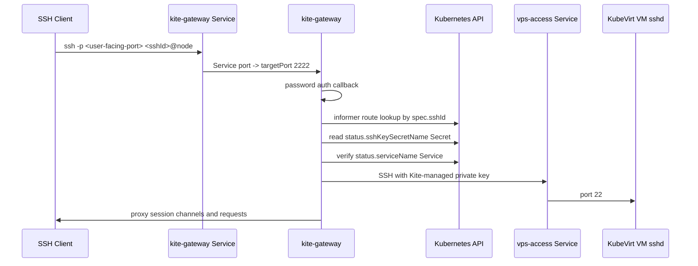

# kite-gateway

`kite-gateway`은 Kubernetes 내부에서 실행되는 Go SSH gateway입니다.
외부 사용자는 Admin Settings에 저장된 user-facing port로 `ssh -p <user-facing-port> <sshId>@<node-ip>` 형태로 접속하고, 이 컴포넌트는 `KiteVirtualMachine` CRD와 VM SSH key Secret을 읽어서 VM의 `vps-access-<vmName>` Service로 SSH 세션을 프록시합니다.
Kubernetes `kite-gateway-external` Service port와 사용자에게 안내할 port는 다를 수 있습니다.

## Current Flow



## Route Rule

v1 route matching is global `sshId` matching:

```text
SSH login username == KiteVirtualMachine.spec.sshId
```

Duplicate live `sshId` values are rejected by the route table.

If no live Kite VM route exists for the SSH username, authentication fails.
The gateway does not proxy host Linux accounts and does not contact host sshd.
Use the host's normal SSH path for direct host administration.

Before password authentication, the gateway may show an SSH login banner. The
default manifest uses it to tell users they are connected to Kite Gateway and
should use a VM `sshId` for VM access.

## Authentication And VM Login

External password authentication is checked against
`KiteVirtualMachine.spec.sshPasswordHash`. The VM creation API accepts
`sshPassword` only in the HTTP request body, hashes it with the runtime
`passwordSalt`, and stores only the hash in the CRD.

The gateway does not forward the external user's password to the VM. After the
external user is authenticated, the gateway reads the VM SSH private key Secret
named by `status.sshKeySecretName` and opens an internal SSH connection as
`spec.sshId` to:

```text
vps-access-<vmName>.<namespace>.svc.cluster.local:22
```

The VM cloud-init creates the same `spec.sshId` Linux user with the matching
public key and disables password SSH login inside the VM.

## External Exposure

The gateway listens on container port `2222`. The base Kubernetes Service is
internal so raw manifest apply and public install scripts do not steal host SSH
port `22`. A Level 3 admin enables external VM SSH access later from Admin
Settings. The controller then creates `service/kite-gateway-external` for VM
SSH traffic only. Admin Settings stores both the Service port that Kubernetes
opens and the user-facing port displayed in the UI. Use different values when an
external router maps a public port such as `22` to a different Service/LB port
such as `12311`.

## Environment

- `KITE_GATEWAY_LISTEN_ADDRESS`: SSH server listen address. Default `:2222`.
- `KITE_GATEWAY_HOST_KEY_PATH`: PEM host key path. Install scripts create the `kite-gateway-host-key` Secret and mount it at `/etc/kite-gateway/ssh/ssh_host_rsa_key`.
- `KITE_GATEWAY_BACKEND_TIMEOUT_SECONDS`: VM sshd wait timeout. Default `90`.
- `KITE_GATEWAY_BACKEND_RETRY_SECONDS`: backend retry interval. Default `2`.
- `KITE_GATEWAY_LOGIN_BANNER`: optional pre-authentication SSH banner shown before the password prompt. Empty disables the banner.

## Host Key

`./build-install.sh` and `./ghcr-install.sh` create `kite-gateway-host-key` automatically when it
does not exist:

```sh
kubectl -n kite get secret kite-gateway-host-key
```

The Secret stores `ssh_host_rsa_key`, which is the SSH server host key seen by
external clients. The installer first tries to copy the existing Linux host
OpenSSH key from `/etc/ssh/ssh_host_ed25519_key`, `ssh_host_ecdsa_key`, or
`ssh_host_rsa_key` so the gateway can use a familiar fingerprint if the operator
later exposes it on a public SSH port. If no host key is available, or automatic
mode cannot read it, it generates a gateway key.

Keeping the key in a Secret prevents SSH host key warnings after gateway pod
restarts. Existing Secrets are not replaced unless
`KITE_GATEWAY_HOST_KEY_REFRESH=true` is set. If someone applies `build/kite`
manually without the Secret, the gateway still starts with an ephemeral key.

## Current Limits

- Password authentication reads `spec.sshPasswordHash` and verifies it with the runtime password salt.
- Public key authentication for external users is not implemented yet.
- VS Code Remote SSH must still be tested against the channel proxy.
