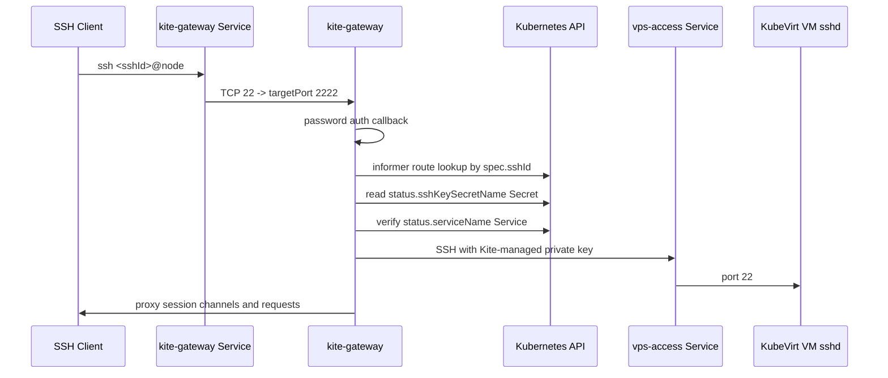

# kite-gateway

`kite-gateway`은 Kubernetes 내부에서 실행되는 Go SSH gateway입니다.
외부 사용자는 `ssh <sshId>@<node-ip>`로 접속하고, 이 컴포넌트는 `KiteVirtualMachine` CRD와 VM SSH key Secret을 읽어서 VM의 `vps-access-<vmName>` Service로 SSH 세션을 프록시합니다.

## Current Flow



## Route Rule

v1 route matching is global `sshId` matching:

```text
SSH login username == KiteVirtualMachine.spec.sshId
```

Duplicate live `sshId` values are rejected by the route table.

If no live Kite VM route exists for the SSH username, the gateway can fall back
to the host OpenSSH daemon. The default manifest points this fallback at the node
IP on port `2222`, and the install/test scripts patch it to the host sshd port
selected during handoff when Kite owns external port `22`.

```text
ssh <host-linux-user>@<node-ip>:22
  -> kite-gateway
  -> no KiteVM spec.sshId match
  -> host sshd at <node-ip>:<selected-host-sshd-port>
```

Kite VM routes have priority. If a VM `spec.sshId` is the same as a host Linux
username, port `22` goes to the VM route. Use `ssh <host-user>@<node-ip> -p
<selected-host-sshd-port>` for direct host administration in that case.

Before password authentication, the gateway may show an SSH login banner. The
default manifest uses it to tell users they are connected to Kite Gateway and
should use a VM `sshId` for VM access.

## Authentication And VM Login

External password authentication is checked against
`KiteVirtualMachine.spec.sshPasswordHash`. The VM creation API accepts
`sshPassword` only in the HTTP request body, hashes it with the runtime
`passwordSalt`, and stores only the hash in the CRD.

The gateway does not forward the external user's password to the VM. After the
external user is authenticated, the gateway reads the VM SSH private key Secret
named by `status.sshKeySecretName` and opens an internal SSH connection as
`spec.sshId` to:

```text
vps-access-<vmName>.<namespace>.svc.cluster.local:22
```

The VM cloud-init creates the same `spec.sshId` Linux user with the matching
public key and disables password SSH login inside the VM.

## Host Port Handoff

The gateway listens on container port `2222`, while the Kubernetes Service
exposes external SSH on port `22`. On Linux hosts that already run OpenSSH on
port `22`, `./dev.sh` and `./install.sh` can move the host sshd listener to
an operator-selected port after user confirmation.
If host sshd already listens on another global port, the scripts do not move it;
they patch `KITE_GATEWAY_HOST_SSHD_ADDRESS` to that detected port instead.

The handoff is handled by `build/deploy/scripts/manage-host-sshd.sh`:

- non-Linux hosts are skipped,
- hosts without systemd OpenSSH are skipped,
- hosts whose sshd is already not using `22` are skipped,
- occupied target ports are rejected before any sshd config is changed,
- interactive runs require typing the selected port again before applying it,
- confirmed changes are backed up under `/etc/kite/host-sshd`,
- `./clear.sh` and `uninstall-kite.sh` can restore that backup.

## Environment

- `KITE_GATEWAY_LISTEN_ADDRESS`: SSH server listen address. Default `:2222`.
- `KITE_GATEWAY_HOST_KEY_PATH`: PEM host key path. Install scripts create the `kite-gateway-host-key` Secret and mount it at `/etc/kite-gateway/ssh/ssh_host_rsa_key`.
- `KITE_GATEWAY_BACKEND_TIMEOUT_SECONDS`: VM sshd wait timeout. Default `90`.
- `KITE_GATEWAY_BACKEND_RETRY_SECONDS`: backend retry interval. Default `2`.
- `KITE_GATEWAY_LOGIN_BANNER`: optional pre-authentication SSH banner shown before the password prompt. Empty disables the banner.
- `KITE_GATEWAY_HOST_FALLBACK_ENABLED`: whether unknown SSH usernames may fall back to host sshd. Default `true`.
- `KITE_GATEWAY_HOST_SSHD_ADDRESS`: host sshd fallback address. The default manifest sets this to `$(KITE_NODE_IP):2222`; install/test scripts patch it to the selected host sshd port after handoff.
- `KITE_GATEWAY_HOST_FALLBACK_TIMEOUT_SECONDS`: host fallback password auth timeout. Default `5`.

## Host Key

`dev.sh` and `install.sh` create `kite-gateway-host-key` automatically when it
does not exist:

```sh
kubectl -n kite get secret kite-gateway-host-key
```

The Secret stores `ssh_host_rsa_key`, which is the SSH server host key seen by
external clients. The installer first tries to copy the existing Linux host
OpenSSH key from `/etc/ssh/ssh_host_ed25519_key`, `ssh_host_ecdsa_key`, or
`ssh_host_rsa_key` so the gateway can preserve the host fingerprint after taking
over port `22`. If no host key is available, it generates a gateway key.

Keeping the key in a Secret prevents SSH host key warnings after gateway pod
restarts. Existing Secrets are not replaced unless
`KITE_GATEWAY_HOST_KEY_REFRESH=true` is set. If someone applies `build/kite`
manually without the Secret, the gateway still starts with an ephemeral key.

## Current Limits

- Password authentication reads `spec.sshPasswordHash` and verifies it with the runtime password salt.
- Public key authentication for external users is not implemented yet.
- VS Code Remote SSH must still be tested against the channel proxy.
