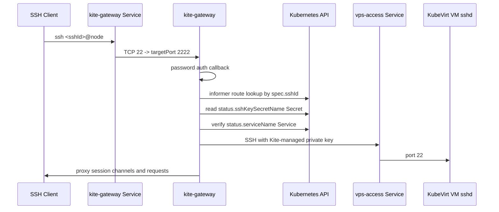

# kite-gateway

`kite-gateway`은 Kubernetes 내부에서 실행되는 Go SSH gateway입니다.
외부 사용자는 `ssh <sshId>@<node-ip>`로 접속하고, 이 컴포넌트는 `KiteVirtualMachine` CRD와 VM SSH key Secret을 읽어서 VM의 `vps-access-<vmName>` Service로 SSH 세션을 프록시합니다.

## Current Flow



## Route Rule

v1 route matching is global `sshId` matching:

```text
SSH login username == KiteVirtualMachine.spec.sshId
```

Duplicate live `sshId` values are rejected by the route table.

## Environment

- `KITE_GATEWAY_LISTEN_ADDRESS`: SSH server listen address. Default `:2222`.
- `KITE_GATEWAY_HOST_KEY_PATH`: PEM host key path. Install scripts create the `kite-gateway-host-key` Secret and mount it at `/etc/kite-gateway/ssh/ssh_host_rsa_key`.
- `KITE_GATEWAY_BACKEND_TIMEOUT_SECONDS`: VM sshd wait timeout. Default `90`.
- `KITE_GATEWAY_BACKEND_RETRY_SECONDS`: backend retry interval. Default `2`.

## Host Key

`dev.sh` and `install.sh` create `kite-gateway-host-key` automatically when it
does not exist:

```sh
kubectl -n kite get secret kite-gateway-host-key
```

The Secret stores `ssh_host_rsa_key`, which is the SSH server host key seen by
external clients. Keeping it in a Secret prevents SSH host key warnings after
gateway pod restarts. If someone applies `build/kite` manually without the
Secret, the gateway still starts with an ephemeral key.

## Current Limits

- Password authentication reads `spec.sshPasswordHash` and verifies it with the runtime password salt.
- Public key authentication for external users is not implemented yet.
- VS Code Remote SSH must still be tested against the channel proxy.
