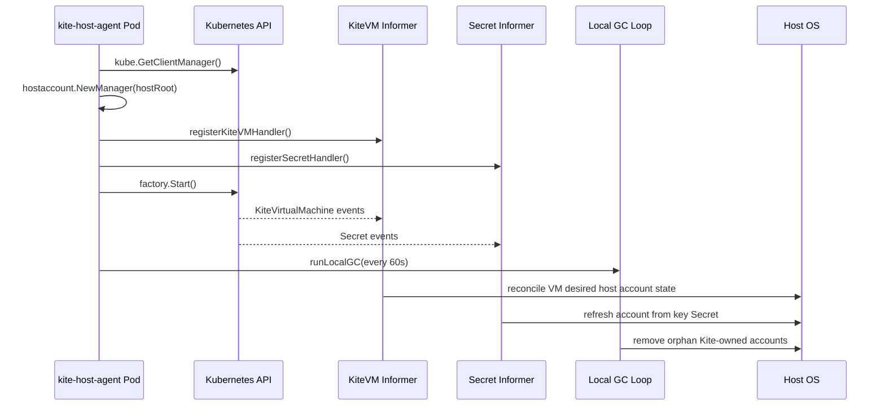
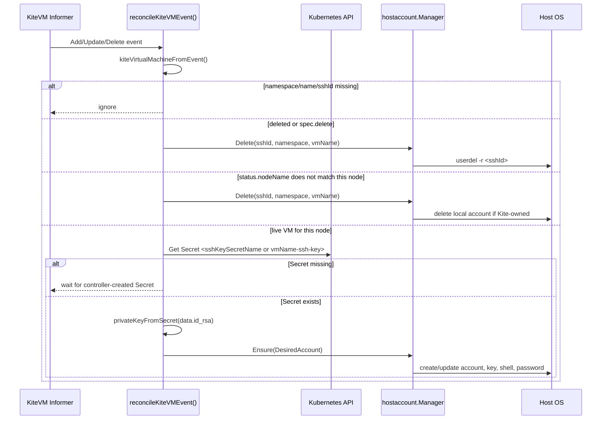
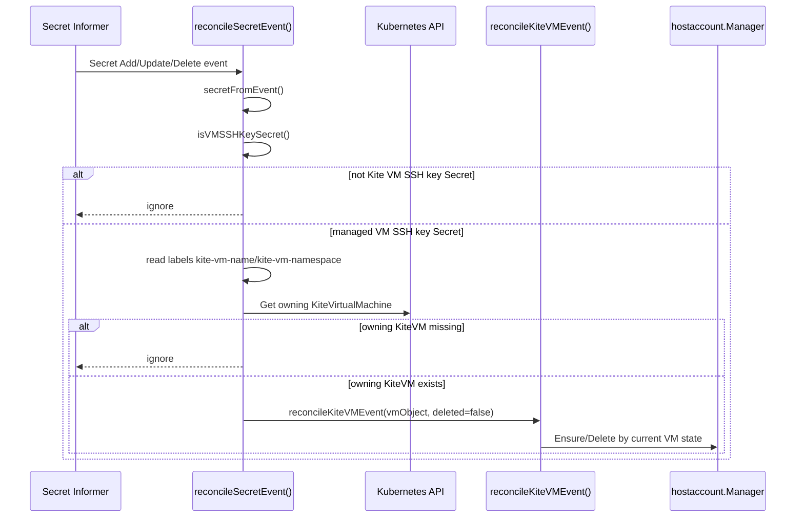
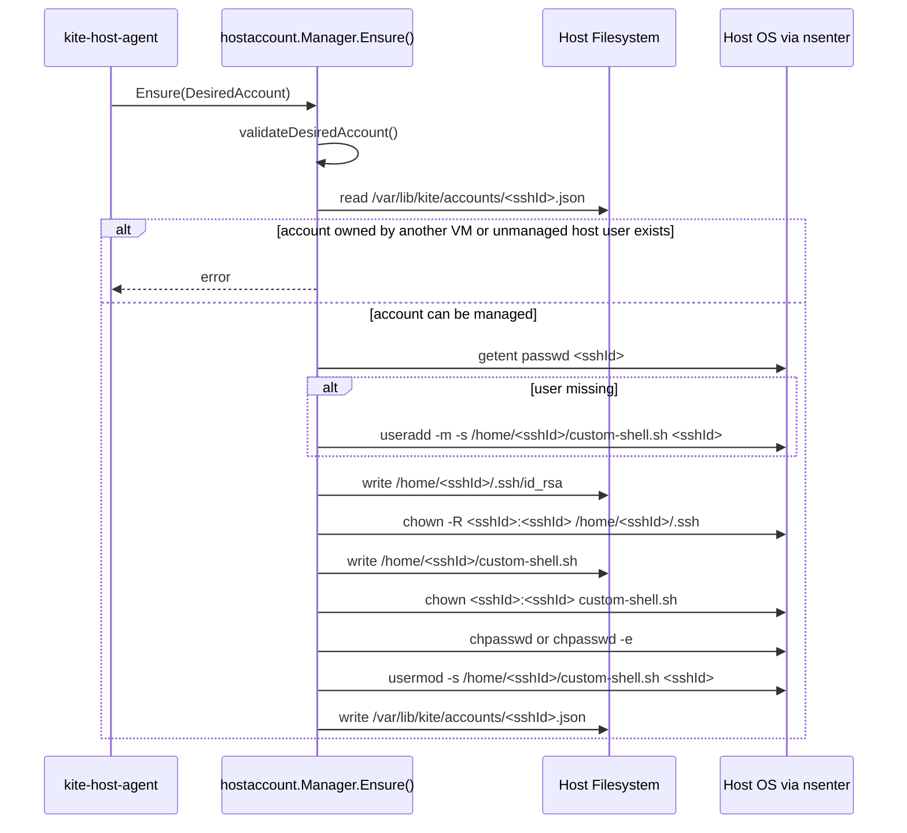
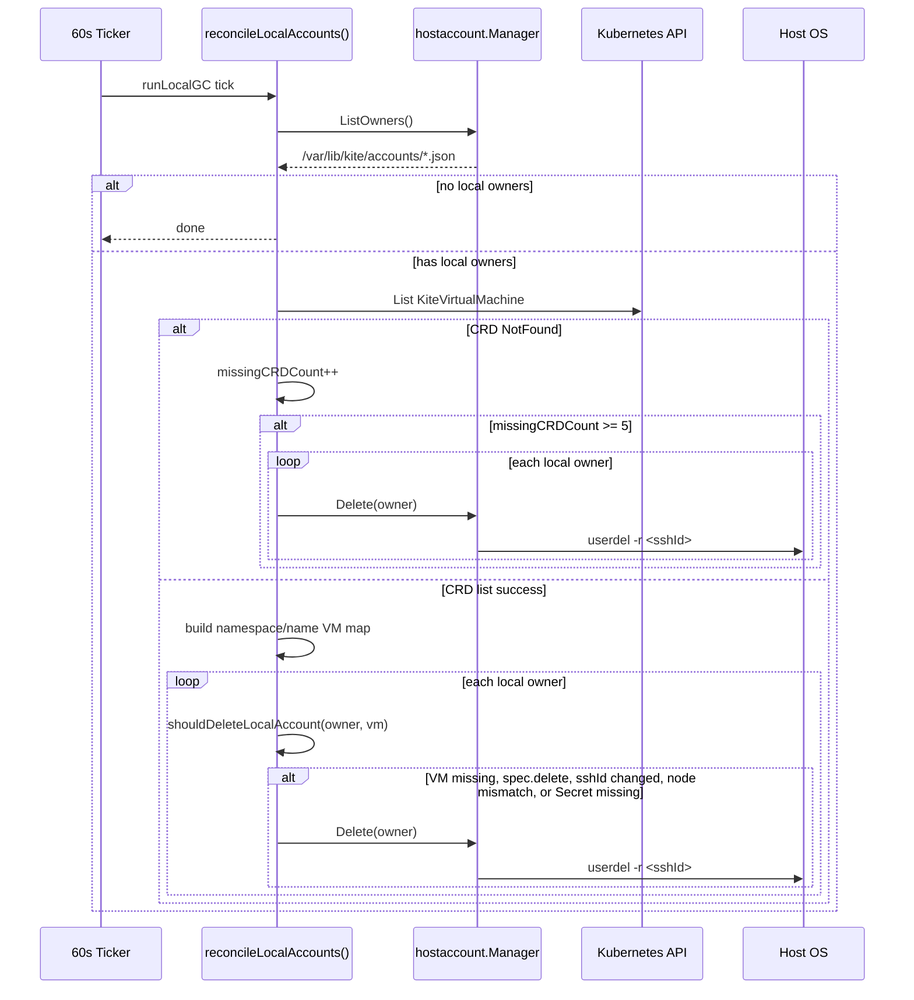

# kite-host-agent

`kite-host-agent`는 각 Kubernetes 노드에서 DaemonSet으로 실행되며, `KiteVirtualMachine` CRD를 기준으로 host Linux 계정과 SSH proxy shell 상태를 맞추는 컴포넌트입니다.

`kite-controller`는 Kubernetes 리소스만 관리하고, `kite-host-agent`는 host OS에 직접 영향을 주는 작업만 담당합니다.

## 역할

- `KiteVirtualMachine` CRD를 watch합니다.
- VM SSH key Secret을 watch합니다.
- VM이 현재 노드에 배정되었으면 host Linux 계정을 생성하거나 갱신합니다.
- Secret의 private key를 `/home/<sshId>/.ssh/id_rsa`에 저장합니다.
- `/home/<sshId>/custom-shell.sh`를 생성하고 해당 유저의 login shell로 설정합니다.
- VM 삭제, `spec.delete`, node mismatch, Secret 삭제, CRD 삭제 상황에서 host 계정을 정리합니다.

## 전제

- `kite-controller`가 VM별 SSH key Secret을 생성합니다.
- Secret 이름은 기본적으로 `<vmName>-ssh-key`입니다.
- Secret에는 `data.id_rsa` private key가 들어갑니다.
- VM SSH Service는 `ClusterIP` 타입이며 이름은 `vps-access-<vmName>`입니다.
- host 계정 이름은 `KiteVirtualMachine.spec.sshId`를 사용합니다.
- VM 내부 접속 유저는 `KiteVirtualMachine.spec.sshId`와 동일합니다.

## 전체 실행 흐름



## KiteVirtualMachine Reconcile

`registerKiteVMHandler`는 `Add`, `Update`, `Delete` 이벤트를 모두 `reconcileKiteVMEvent`로 보냅니다.



### Decision Rules

```go
// 삭제 이벤트, spec.delete=true, 또는 이 노드 담당 VM이 아니면 local 계정을 지웁니다.
if deleted || vm.Spec.Delete || !accountShouldHandleVM(vm, nodeName) {
    return manager.Delete(ctx, vm.Spec.SSHID, vm.Namespace, vm.Name)
}

// 그 외에는 Secret의 private key를 읽고 host 계정을 원하는 상태로 맞춥니다.
return ensureAccountForVM(ctx, dynamicClient, manager, nodeName, vm)
```

`accountShouldHandleVM`은 `status.nodeName`이 비어 있으면 true를 반환합니다. 현재 싱글 노드 개발 환경에서는 nodeName이 아직 비어 있어도 계정을 만들 수 있게 하기 위한 fallback입니다.

## Secret Reconcile

`registerSecretHandler`는 VM SSH key Secret 변경을 감지합니다. Secret이 새로 생기거나 private key가 바뀌면, 해당 VM의 host 계정도 다시 맞춥니다.



### Required Secret Labels

```yaml
metadata:
  labels:
    hy3ons.github.io/managed-by: kite-controller
    hy3ons.github.io/kite-secret-type: vm-ssh-key
    hy3ons.github.io/kite-vm-name: <vmName>
    hy3ons.github.io/kite-vm-namespace: <vmNamespace>
```

## Host Account Ensure

`hostaccount.Manager.Ensure`는 하나의 VM에 대응하는 host 계정을 선언적 상태로 맞춥니다.



### DesiredAccount Mapping

```go
hostaccount.DesiredAccount{
    Username:         vm.Spec.SSHID,
    Password:         vm.Spec.SSHPassword,
    VMNamespace:      vm.Namespace,
    VMName:           vm.Name,
    NodeName:         nodeName,
    SSHKeySecretName: secretName,
    PrivateKey:       privateKey,
    ServiceName:      serviceNameForVM(vm),
    ServiceNamespace: vm.Namespace,
    VMUser:           vm.Spec.SSHID,
}
```

## Proxy Shell

생성되는 shell은 host SSH 로그인 직후 VM의 ClusterIP Service DNS로 다시 SSH 접속합니다.

```bash
#!/bin/bash
PRIVATE_KEY="/home/<sshId>/.ssh/id_rsa"
VM_TARGET="<sshId>@vps-access-<vmName>.<namespace>.svc.cluster.local"

exec ssh -i "$PRIVATE_KEY" -o StrictHostKeyChecking=no -o UserKnownHostsFile=/dev/null "$VM_TARGET" "$@"
```

`"$@"`를 유지하는 이유는 VS Code Remote SSH처럼 SSH 명령 뒤에 붙는 원격 command를 VM 내부 SSH로 그대로 전달하기 위해서입니다.

## Local GC Reconcile

Informer delete 이벤트를 놓치거나, CRD/Secret이 비정상적으로 사라지는 경우를 대비해 local metadata 기준의 mark-and-sweep GC를 수행합니다.



### GC 삭제 조건

```go
if vm == nil || vm.Spec.Delete {
    return true
}
if vm.Spec.SSHID != owner.Username {
    return true
}
if !accountShouldHandleVM(vm, nodeName) {
    return true
}

_, err := dynamicClient.Resource(secretGVR).Namespace(owner.VMNamespace).Get(ctx, secretName, metav1.GetOptions{})
return apierrors.IsNotFound(err)
```

CRD가 일시적으로 조회되지 않는 순간에 모든 계정을 지우면 위험하므로, `crdMissingSweepThreshold` 값인 5회 연속 NotFound 이후에만 전체 local 계정을 정리합니다.

## Host File Layout

```text
/host
├── home
│   └── <sshId>
│       ├── .ssh
│       │   └── id_rsa
│       └── custom-shell.sh
└── var
    └── lib
        └── kite
            └── accounts
                └── <sshId>.json
```

`<sshId>.json`은 이 계정이 Kite가 만든 계정인지, 어떤 VM이 소유하는지 판단하는 기준입니다. 이 파일이 없으면 `kite-host-agent`는 기존 host 계정을 직접 삭제하지 않습니다.

## Environment Variables

```yaml
env:
  - name: KITE_HOST_AGENT_HOST_ROOT
    value: /host
  - name: KITE_NODE_NAME
    valueFrom:
      fieldRef:
        fieldPath: spec.nodeName
```

- `KITE_HOST_AGENT_HOST_ROOT`: host filesystem mount 경로입니다. 기본값은 `/host`입니다.
- `KITE_NODE_NAME`: 현재 DaemonSet Pod가 떠 있는 Kubernetes node 이름입니다.

## Security Notes

- host 계정 생성/삭제를 위해 privileged container와 `nsenter`를 사용합니다.
- Secret private key는 host의 `/home/<sshId>/.ssh/id_rsa`에 `0600` 권한으로 저장합니다.
- proxy shell은 `/home/<sshId>/custom-shell.sh`에 `0755` 권한으로 저장합니다.
- 기존 host 계정과 충돌하면 overwrite하지 않고 error를 반환합니다.
- `/var/lib/kite/accounts/<sshId>.json` owner metadata가 일치할 때만 삭제합니다.
