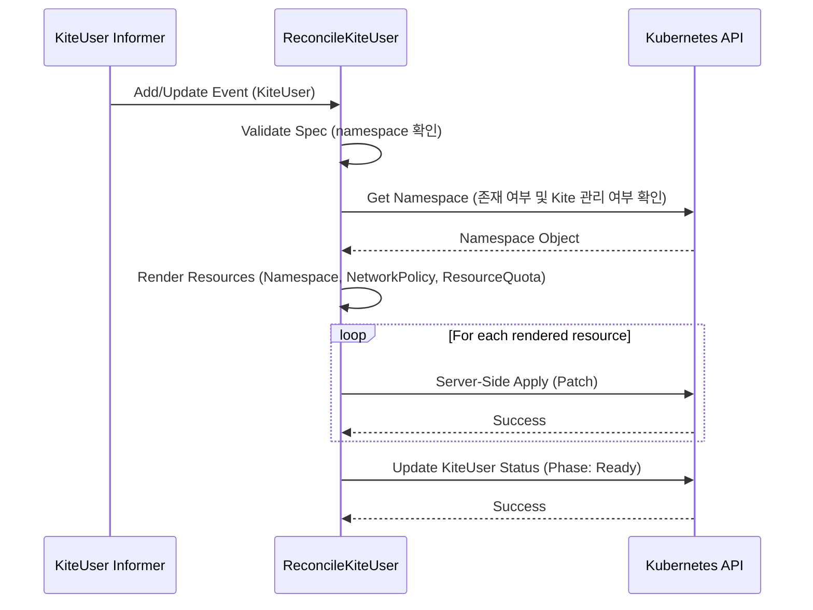
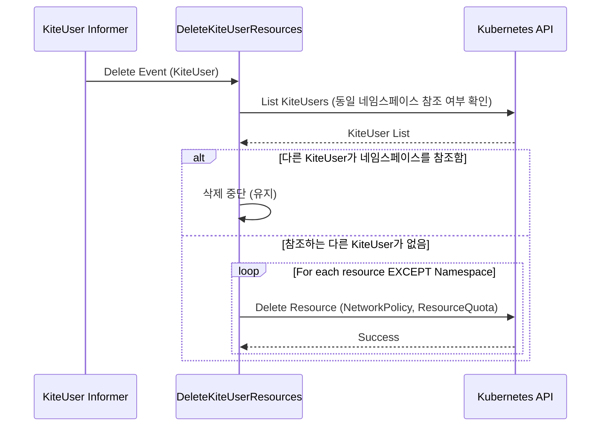
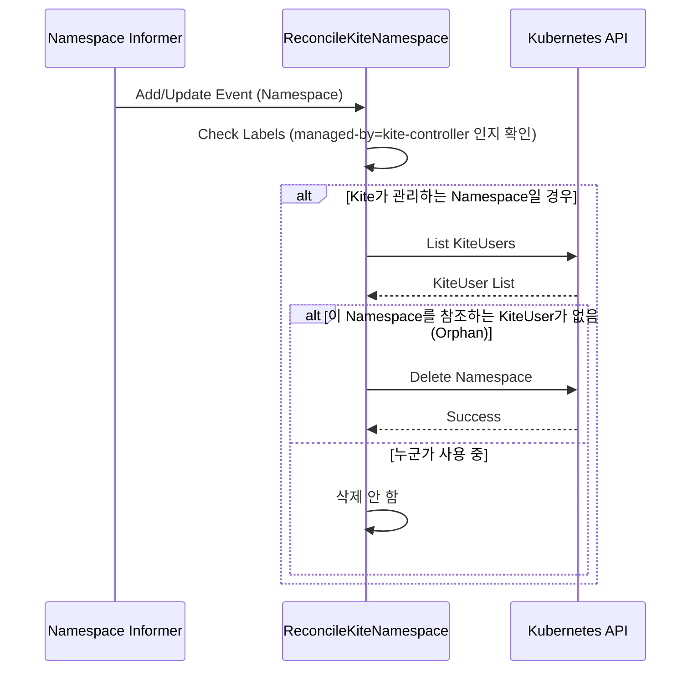
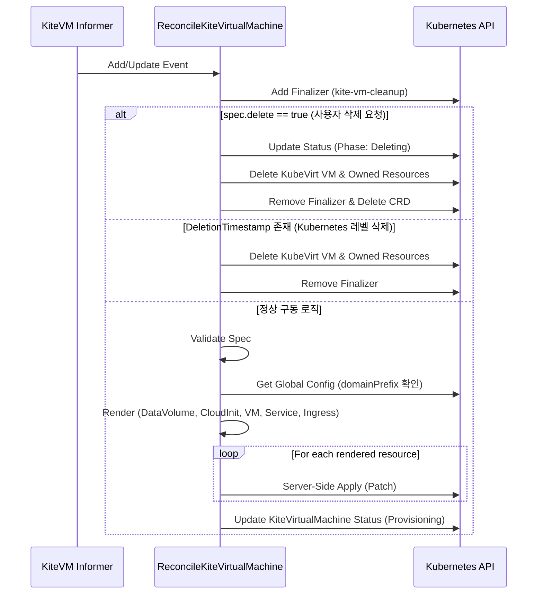
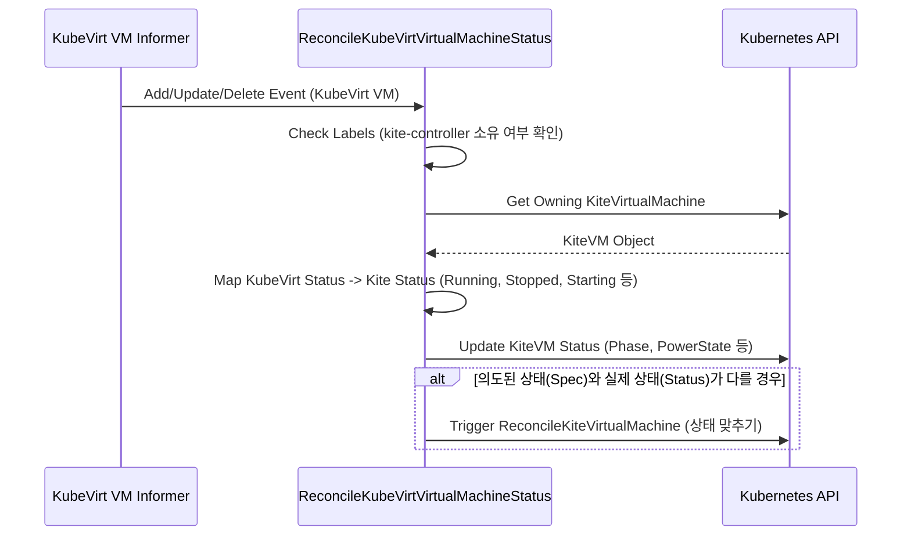
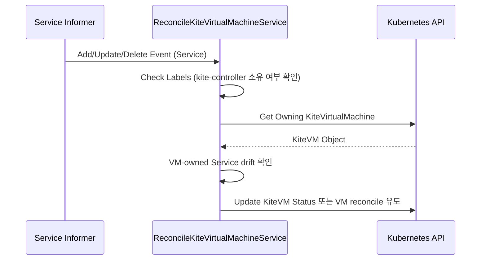
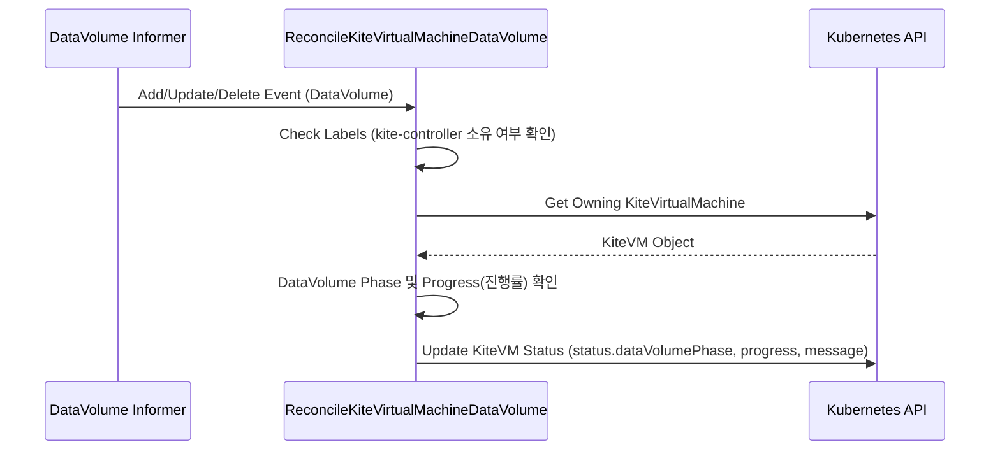

# Kite Controller Sequence Diagrams

## 1. KiteUser Reconciler (`user-reconcile.go`)

## 2. Kite Namespace Reconciler (`namespace-reconcile.go`)

## 3. Kite Virtual Machine Reconciler (`machine-reconcile.go`)

## 4. KubeVirt Virtual Machine Status Reconciler (`kubevirt-status-reconcile.go`)

## 5. Kite VM Service Reconciler (`vm-service-reconcile.go`)

## 6. Kite VM DataVolume Reconciler (`data-volume-reconcile.go`)

